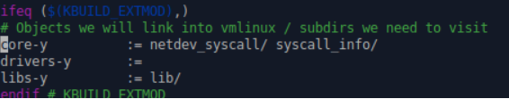
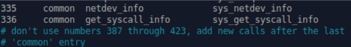

# Инструкция по установке

1. Поместить исходный код (каждый вызов в своей директории) в папку с исходниками ядра Linux.

2. Рядом с кодом системного вызова добавить Makefile со следующим содержанием:

    ```obj-y := <source_file_name>.o```

3. Найти строчку ```core-y``` в Makefile, дополнив ее названиями директорий с исходным кодом.

    

4. Добавить в конец файла (перед #endif) ```include/linux/syscalls.h``` сигнатуры добавляемых системных вызовов:
    ```c
    asmlinkage long sys_netdev_info(const char* name, void* target);
    asmlinkage long sys_get_syscall_info(int proc_id, void* target);
    ```

5. Дополнить таблицу системных вызовов arch/x86/entry/syscalls/syscall_64.tbl, присвоив новым системным вызовам свободные номера:

   

6. Собрать ядро (значение параметра -j варьируется в зависимости от количества ядер на машине):

   ```c
   sudo make -j2
   sudo make modules_install -j2
   sudo make install -j2
   sudo update-grub
   ```
   
7. Перезагрузить систему. После этого новые вызовы должны быть доступны по номерам, указанным в п. 5.
